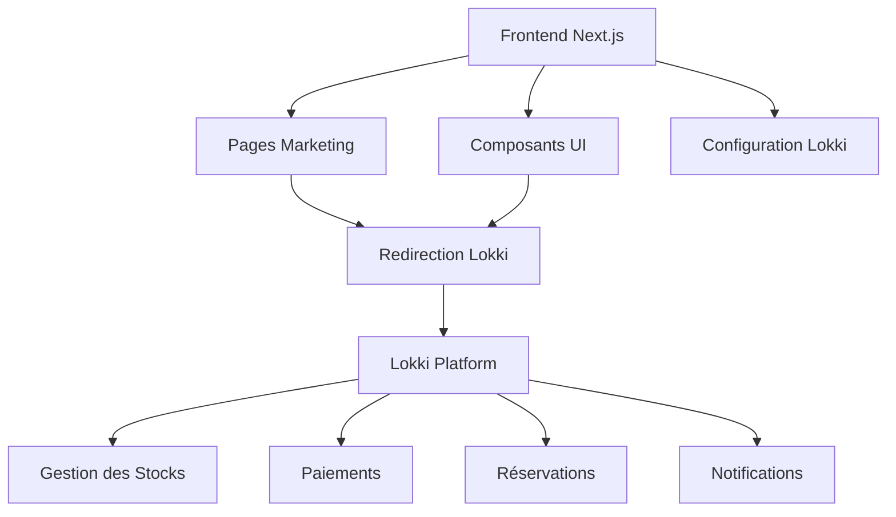

# Documentation d'Architecture - RentaTour

## Vue d'ensemble

RentaTour est une application web frontend-only de location de vélos et de tours guidés à Paris, développée avec Next.js 15 et TypeScript. L'application fonctionne comme une vitrine marketing qui redirige les utilisateurs vers la plateforme Lokki pour toutes les transactions et réservations.

## Architecture Générale

### Principe Fondamental

L'application adopte une approche **frontend-only** avec redirection externe vers Lokki pour :

- Gestion des stocks de vélos
- Traitement des paiements
- Gestion des réservations
- Notifications clients

### Stack Technologique

#### Frontend

- **Framework**: Next.js 15 (App Router)
- **Langage**: TypeScript
- **Styling**: Tailwind CSS avec configuration personnalisée
- **UI Components**: Radix UI + shadcn/ui
- **State Management**: React Query (TanStack Query)
- **Animations**: Framer Motion (via Lenis)
- **Icons**: Lucide React
- **Charts**: Recharts

#### Configuration

- **Build Tool**: Next.js avec Turbopack
- **Package Manager**: pnpm
- **Linting**: ESLint avec configuration Next.js
- **Type Checking**: TypeScript strict mode

## Structure du Projet

```
src/
├── app/                          # App Router (Next.js 15)
│   ├── (landing)/               # Route group pour la landing page
│   ├── about/                   # Page À propos
│   ├── rent/                    # Page de location
│   ├── tours/                   # Page des tours
│   ├── layout.tsx               # Layout racine
│   └── fonts/                   # Polices personnalisées
├── components/                   # Composants React
│   ├── nav/                     # Navigation (header, footer, menu)
│   ├── sections/                # Sections de pages
│   ├── shared/                  # Composants partagés
│   └── ui/                      # Composants UI de base
├── config/                      # Configuration
│   ├── site.ts                  # Configuration du site
│   ├── fonts.ts                 # Configuration des polices
│   ├── defaults.ts              # Valeurs par défaut
│   ├── pricing.ts               # Configuration centralisée des prix
│   └── lokki.ts                 # Configuration Lokki
├── data/                        # Données statiques
│   ├── tourData.ts              # Données des tours
│   ├── testimonials.ts          # Témoignages
│   └── static-content.ts        # Contenu statique
├── hooks/                       # Hooks personnalisés
│   └── use-lokki-redirect.ts    # Hook de redirection
├── lib/                         # Utilitaires
│   ├── utils/                   # Fonctions utilitaires
│   └── analytics.ts             # Tracking et analytics
├── providers/                   # Providers React
│   ├── providers.tsx            # Provider principal
│   ├── theme-provider.tsx       # Gestion des thèmes
├── styles/                      # Styles globaux
│   └── globals.css              # CSS global
└── types/                       # Définitions TypeScript
    ├── index.d.ts               # Types principaux
    └── next-auth.d.ts           # Types NextAuth
```

## Modèles de Données

### Types Principaux

```typescript
// Types pour le contenu des vélos
interface BikeContent {
  name: string;
  description: string;
  dailyRate: number;
  image: string;
  features: string[];
  limitations: string[];
}

// Types pour le contenu des tours
interface TourContent {
  title: string;
  subtitle: string;
  description: string;
  price: string;
  image: string;
  details: {
    location: string;
    duration: string;
    schedule: string;
  };
  additionalContent?: {
    visionTitle: string;
    bulletPoints: string[];
    closingNote: string;
  };
  ctaMoreInfo: string;
  ctaBookNow: string;
  ctaContact: string;
}

// Types pour le contenu des accessoires
interface AccessoriesContent {
  title: string;
  description: string;
  image: string;
}
```

### Configuration du Site

```typescript
// config/site.ts
export const siteConfig = {
  name: "RentaTour",
  description: "Services de location de vélos et tours guidés à Paris",
  url: "https://rentatour.com",
  keywords: [
    "Bike Tours",
    "Bike Rentals",
    "Paris Tours",
    "City Biking",
    "Adventure Tours",
    "Bike Hire",
    "Explore Paris",
    "Cycling Experiences",
    "Sightseeing by Bike",
    "Paris Bike Routes",
  ],
  navItems: [
    { title: "Tours", href: "/tours" },
    { title: "Rent", href: "/rent" },
    { title: "About", href: "/about" },
  ],
};
```

## Intégration Lokki

### Architecture de Redirection



### Configuration Lokki

```typescript
// config/lokki.ts
export const lokkiConfig = {
  baseUrl: "https://rentabikeparis.lokki.com",
  endpoints: {
    bikeRental: "/rent",
    tours: "/tours",
    booking: "/booking",
    contact: "/contact",
    about: "/about",
  },
  tracking: {
    utmSource: "rentatour-website",
    utmMedium: "referral",
    utmCampaign: "bike-tours-paris",
  },
  features: {
    openInNewTab: true,
    trackClicks: true,
    analytics: true,
  },
};
```

### Composants de Redirection

```typescript
// components/lokki-redirect-button.tsx
interface LokkiRedirectButtonProps {
  type: "bike-rental" | "tour" | "booking";
  children: React.ReactNode;
  className?: string;
}

export function LokkiRedirectButton({
  type,
  children,
  className,
}: LokkiRedirectButtonProps) {
  const handleRedirect = () => {
    const url = `${lokkiConfig.baseUrl}${lokkiConfig.endpoints[type]}?utm_source=${lokkiConfig.tracking.utmSource}&utm_medium=${lokkiConfig.tracking.utmMedium}`;
    window.open(url, "_blank");
  };

  return (
    <button onClick={handleRedirect} className={className}>
      {children}
    </button>
  );
}
```

### Hook de Redirection

```typescript
// hooks/use-lokki-redirect.ts
import { useCallback } from "react";
import { lokkiConfig } from "@/config/lokki";

export function useLokkiRedirect() {
  const redirectToLokki = useCallback(
    (
      type: keyof typeof lokkiConfig.endpoints,
      params?: Record<string, string>
    ) => {
      const baseUrl = lokkiConfig.baseUrl;
      const endpoint = lokkiConfig.endpoints[type];
      const utmParams = new URLSearchParams({
        utm_source: lokkiConfig.tracking.utmSource,
        utm_medium: lokkiConfig.tracking.utmMedium,
        utm_campaign: lokkiConfig.tracking.utmCampaign,
        ...params,
      });

      const url = `${baseUrl}${endpoint}?${utmParams.toString()}`;

      if (lokkiConfig.features.openInNewTab) {
        window.open(url, "_blank");
      } else {
        window.location.href = url;
      }
    },
    []
  );

  return { redirectToLokki };
}
```

## Fonctionnalités

### Pages Disponibles

1. **Landing Page** (`/`) - Page d'accueil avec sections hero, tours, tarifs
2. **Tours** (`/tours`) - Liste des tours guidés disponibles
3. **Rent** (`/rent`) - Interface de location de vélos
4. **About** (`/about`) - Page à propos

### Composants Principaux

- **Navigation**: Header responsive avec menu mobile
- **Sections**: Hero, tours, tarifs, témoignages, FAQ, contact
- **UI Components**: Boutons, cartes, modales, formulaires
- **Shared**: Thème, scroll fluide, indicateurs
- **Lokki Integration**: Boutons de redirection, tracking

### Données Statiques

```typescript
// data/static-content.ts
export const staticContent = {
  bikes: [
    {
      id: "deluxe7",
      name: "Deluxe 7 - Normal Bike",
      description: "A comfortable and reliable city bike...",
      price: 15,
      features: ["7-speed gear system", "Comfortable saddle"],
      lokkiUrl: "/rent?bike=deluxe7",
    },
    // ... autres vélos
  ],
  tours: [
    {
      id: "paris-tour",
      name: "All around Paris by Bike",
      description: "Full tour of Paris landmarks...",
      price: 45,
      duration: "3 hours",
      lokkiUrl: "/tours?tour=paris-tour",
    },
    // ... autres tours
  ],
};
```

## Analytics et Tracking

### Configuration Analytics

```typescript
// lib/analytics.ts
export function trackLokkiClick(type: string, action: string) {
  // Google Analytics 4
  if (typeof gtag !== "undefined") {
    gtag("event", "lokki_redirect", {
      event_category: "engagement",
      event_label: `${type}_${action}`,
    });
  }

  // Vercel Analytics
  if (typeof va !== "undefined") {
    va.track("lokki-redirect", { type, action });
  }
}
```

### Outils Intégrés

- **Vercel Analytics** (déjà intégré)
- **Google Analytics 4** (recommandé)
- **Sentry** pour le monitoring d'erreurs (optionnel)

## Avantages de l'Architecture

### ✅ Simplicité

- **Pas de base de données** à gérer ou maintenir
- **Pas d'API backend** complexe à développer
- **Déploiement simplifié** sur Vercel/Netlify
- **Coûts réduits** (pas de serveur de base de données)

### ✅ Sécurité

- **Pas de données sensibles** stockées localement
- **Gestion des paiements** externalisée vers Lokki
- **Conformité RGPD** simplifiée
- **Maintenance de sécurité** réduite

### ✅ Performance

- **Site statique** ultra-rapide
- **CDN global** pour la distribution
- **Pas de latence** de base de données
- **SEO optimisé** avec Next.js

### ✅ Évolutivité

- **Focus sur l'UX** et le marketing
- **Facilité de maintenance**
- **Déploiements rapides**
- **Concentration sur le contenu**

## Conclusion

Cette architecture frontend-only avec redirection vers Lokki est optimale pour une vitrine marketing efficace. Elle permet de créer une expérience utilisateur exceptionnelle tout en déléguant la complexité business à une plateforme spécialisée.

---

_Documentation d'architecture - Version 2.0_
